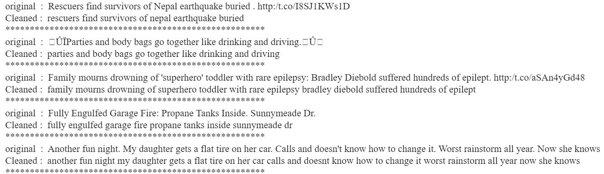

# tweets-Analysis---Disaster-or-No_Disaster

## Project Description: 
This project is part of Kaggle prediction competitions - [Natural Language Processing with Disaster Tweets](https://www.kaggle.com/c/nlp-getting-started. It is given 7613 training tweets and 3263 test tweets to make prediction. In this notebook, I will use different approaches, compare results to each other, visualize their embeddings and combine some of the models. 

## Set up Environment:
The easiest way to run the project is [google colab](https://colab.research.google.com/)

##Table of content:
1. Import Libraries, funtions and dataset
2. 

### 1. Import Libraries, funtions and dataset
Important packages are installed, some useful already [prepared funtions](https://raw.githubusercontent.com/gurokeretcha/gurokeretcha/main/helper_funtions_ML.py) and libraries are imported 

### 2. Understand the Data
- Training dataset shape: (7613, 5)
- Test dataset shape: (3263, 4)
- target variable may be considered as balanced because values of no-disaster is 4342 and disaster - 3271. 
- Fill keyword nan values with "unknown"

### 3. Clean the data 
**note**: cleaning the data can be modified in a different way.
- In this part I just removed repetitive puntuation. For example:  "????" -> "?".
- also extra links, non-asci characters and extra spaces are removed.
- Some of the examples are shown bellow:

### 4. Feature Engineering
in this part some additional numerical features are generated, however not all the models are using this data.
- Genereted 4 features are : number of tokenss, number of characters, number of stop words, unique word count.
- The histograms shown bellow illustrated how these features are distributed between disaster(1) vs no-disaster(0) tweets.

 
 ### 5. Inspect The data More
 - vocabulary size is: 22409
 - words which apear at least twice are: 8231
 left plot shown bellow illustrates the distribution of a word count in tweets, as it shows 98% of word count is a sentence is up to 26 words in a tweet. Right plot hilights unique word count, which follows Zipf's Law - few words appear in a corpus  really many times and a lot of words occurs a few times.

### 6. Prepare data for training
- split data into train and test set with (85%/15% proportion)
- `keyword` column in a dataframe contains up to 250 unique words, that is why baseN encoder (with base 2) is used in order to represent each word in a few dimention space.
- numerical columns are scaled using MinMaxScaler from Sklearn Library

### 7. Embedding
In this part three types of embeddings will be done: **TF-IDF**, **Word2Vec**, **Universal Sentence Encoder**, which will be compared to each other using visualization.
- TF-IDF embedding shape: (6471, 15234)
- Word2Vec embedding shape: (6471, 500)
- USE embedding shape: (6471, 512)
since we can not visualize high dimension data, first we use dimention reduction techniques to reduce its dimension to 2 and then visualize. that is why TruncatedSVD is used.
plot bellow illustrates the embeddings of each type. disaster tweets are red and no-disaster - blue dots.

